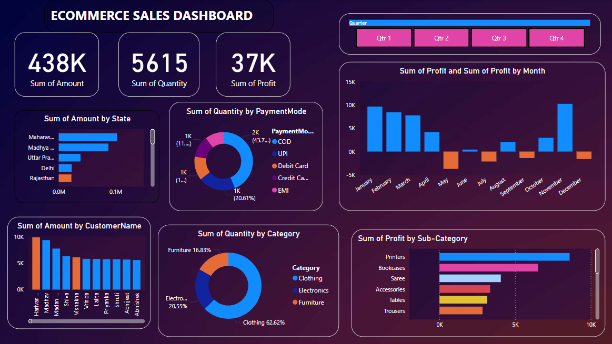

E-commerce data analysis using Power BI involves visualizing and analyzing sales, customer behavior, and product performance data to gain actionable insights. By creating interactive dashboards and reports, businesses can track key metrics, identify trends, and make data-driven decisions to optimize their operations and boost sales.
# E-Commerce Sales Dashboard using Power BI

The **E-Commerce Sales Dashboard** is a comprehensive analytical tool designed to help businesses track, analyze, and visualize their sales performance. By leveraging Power BI, this dashboard uncovers insights into customer behavior, product performance, and revenue trends to support data-driven decision-making.

## Features
- **Sales Overview**:
  - Visualization of total sales, revenue, and profit by region and product category.
- **Product Performance**:
  - Analysis of top-performing and underperforming products based on sales and revenue.
- **Customer Insights**:
  - Demographic trends, purchase patterns, and segmentation by loyalty metrics.
- **Time-Based Analysis**:
  - Month-over-month and seasonal sales trends for strategic planning.
- **Interactive Filters**:
  - Dynamic slicers to filter data by product category, region, time period, and customer segments.

## Technologies Used
- **Power BI**: For creating dynamic, interactive dashboards.
- **Data Sources**: Sample e-commerce dataset (CSV/Excel).
- **Power Query**: For data cleansing and transformation.
- **DAX (Data Analysis Expressions)**: For calculated fields, KPIs, and custom measures.

## Key Dashboards
1. **Sales Performance**:
   - Total sales, revenue, and profit trends.
   - Region-wise and category-wise analysis.
2. **Product Insights**:
   - Top-selling products and revenue contribution by product categories.
3. **Customer Trends**:
   - New vs. returning customers, demographics, and purchase frequency.
4. **Time-Based Trends**:
   - Seasonal patterns and sales growth over months and years.

### Dashboard Previews
  

## Project Goals
- Analyze sales performance to identify growth opportunities.
- Uncover insights into customer behavior and loyalty trends.
- Optimize inventory and marketing strategies based on product performance.
- Track seasonal trends and revenue growth.

## Prerequisites
1. **Power BI Desktop**: Download it from [Microsoft Power BI](https://powerbi.microsoft.com/desktop/).
2. **Sample Data**: Use the dataset provided in the `/data` folder or connect to your own sales data.

## Setup Instructions
1. Clone this repository:
   ```bash
   git clone https://github.com/jatinAB/E-Commerce-Sales-Dashboard.git
